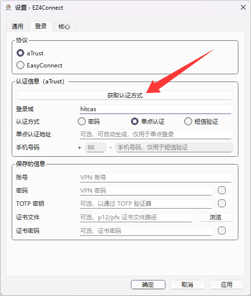

# EZ4Connect

*前身为 HITsz Connect for Windows*

改进的 ZJU-Connect 图形界面

## 🎉 现已正式提供 aTrust 支持

如使用中遇到问题，可加入 ZJU-Connect 用户反馈 QQ 群 1037726410 交流。

## 使用方式

1. 在本项目的 [Releases](https://github.com/chenx-dust/EZ4Connect/releases) 页面下载最新版本：

- **Windows 用户**：下载 `EZ4Connect-vX.X.X-windows-ARCH.zip` ，解压至同一目录下，双击运行 `EZ4Connect.exe` ；
  - 如果遇到缺少 DLL 等问题，请先下载安装 Microsoft Visual C++ 可再发行程序包版本（[x64](https://aka.ms/vs/17/release/vc_redist.x64.exe) | [arm64](https://aka.ms/vs/17/release/vc_redist.arm64.exe)），再运行程序；
- **macOS 用户**：下载 `EZ4Connect-vX.X.X-macOS-ARCH.dmg` ，按照镜像内部指示安装，并运行修复脚本；
  - 如果遇到“Apple 无法检查 App 是否包含恶意软件”等报错，请参考 [Apple 支持](https://support.apple.com/zh-cn/guide/mac-help/mchleab3a043/mac) 进行操作
- **Linux 用户**：下载 `EZ4Connect-vX.X.X-linux-ARCH.AppImage` ，赋予执行权限，运行即可；
  - AppImage x64 仅支持系统 `glibc >= 2.31` 的发行版，Ubuntu 22.04 及以上版本可以正常运行（受限于 GitHub Actions Runner）；
  - AppImage arm64 仅支持系统 `glibc >= 2.38` 的发行版，Ubuntu 24.04 及以上版本可以正常运行（受限于 Qt 官方：[参考](https://doc.qt.io/qt-6/supported-platforms.html)）；
  - Arch Linux 用户推荐使用 [AUR](https://aur.archlinux.org/packages/ez4connect) 安装；
  - 如果遇到因依赖问题无法运行的情况，请自行编译运行。

2. 在 “文件”-“设置”-“核心” 页面中设置好服务器地址；

3. 在 “文件”-“设置”-“认证” 页面中，选择对应的服务器类型，配置认证信息；

> [!NOTE]
> aTrust 服务器支持多种认证方式，如需选择请点击“获取认证方式”按钮。除非您十分了解登录信息，否则不建议手动配置。

4. 在主界面中点击“连接服务器”。如果只需进行校园网页浏览，则选择“设置系统代理”后即可使用。

如果需要配合 Clash / Mihomo 进行高级的分流操作，可以参见： [高级使用方式](docs/ADVANCED_USAGE.md)

## 路线图

如有更多好的建议，可以在 Issue 中或是 OSA 群里提出！

- [X] 支持 macOS 系统
- [X] 支持 Linux 系统
- [X] 支持手动设置 Proxy Bypass
- [X] 上传 AUR 包
- [ ] 使用密钥链存储密码等信息

## 相关项目

以下均为 EasyConnect 客户端的桌面友好替代品，可按需使用：

- [kowyo/hitsz-connect-verge](https://github.com/kowyo/hitsz-connect-verge): 轻量级的 ZJU-Connect 客户端，基于 PyQt ，支持 Windows 和 macOS ，面向 HITSZ 用户
- [Mythologyli/ZJU-Connect-for-Windows](https://github.com/Mythologyli/ZJU-Connect-for-Windows): 基于 Qt 的 ZJU-Connect 客户端，本项目的前身，支持 Windows ，面向 ZJU 用户
- [docker-easyconnect/docker-easyconnect](https://github.com/docker-easyconnect/docker-easyconnect): 利用 Docker 隔离的 EasyConnect 客户端

## 致谢

- [Mythologyli/ZJU-Connect-for-Windows](https://github.com/Mythologyli/ZJU-Connect-for-Windows)
- [Mythologyli/zju-connect](https://github.com/Mythologyli/zju-connect)

> 欢迎加入 HITSZ 开源技术协会 [@hitszosa](https://github.com/hitszosa)
